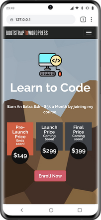

## Learn 2 Code With Anthony

This is my brand new coding platform where I will teach beginners and bootcamp students how to Code online.

## Project Specifications

- Sign up for online classes
- View various pricing and package options
- Send a message to the instructor with questions
- View comments from different students and get your questions answered.
- Full Scale Blog 
- Resources page with downloadable content

## Steps to execute this Website:
- Download the entire code 
- Open up the index.html.
- [View Live Form](https://github.com/anthonys1760/Learn2CodeWithAnthony)

## Technologies used: 
- HTML
- CSS [style/Presentation]
- PHP
